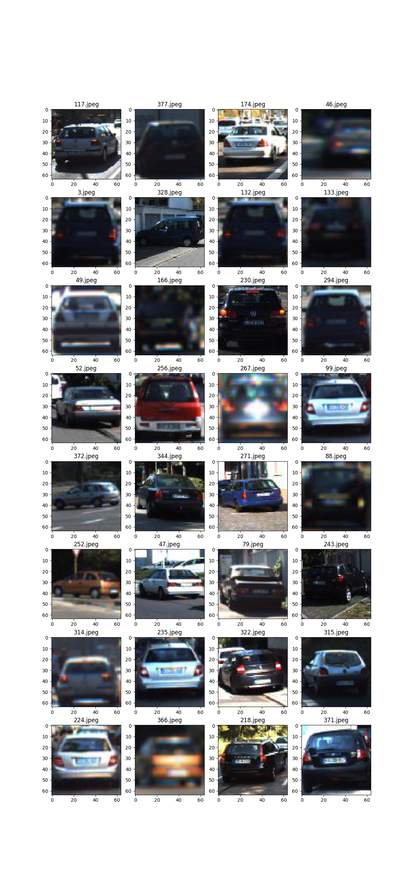
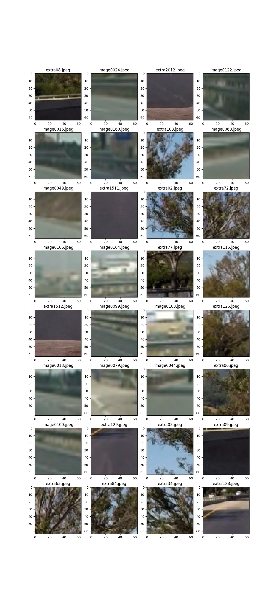
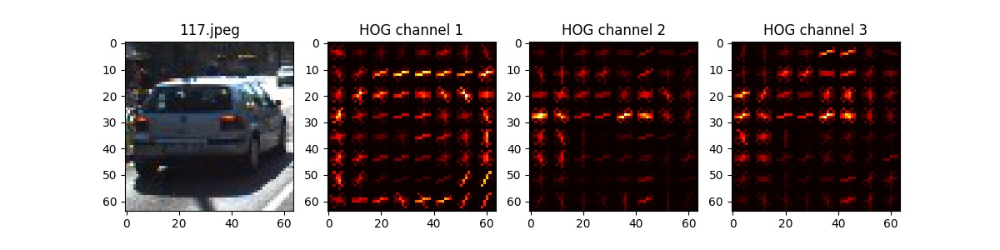
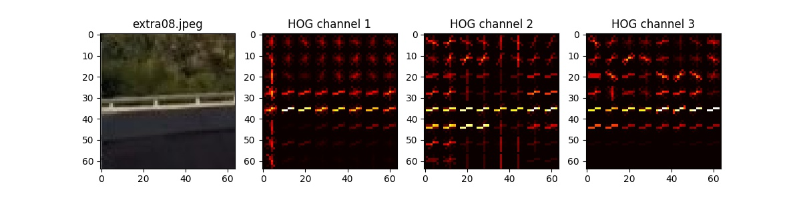
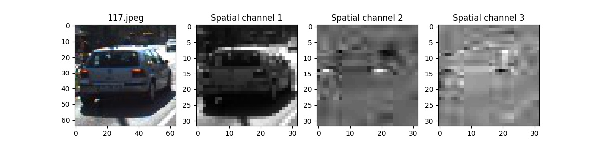
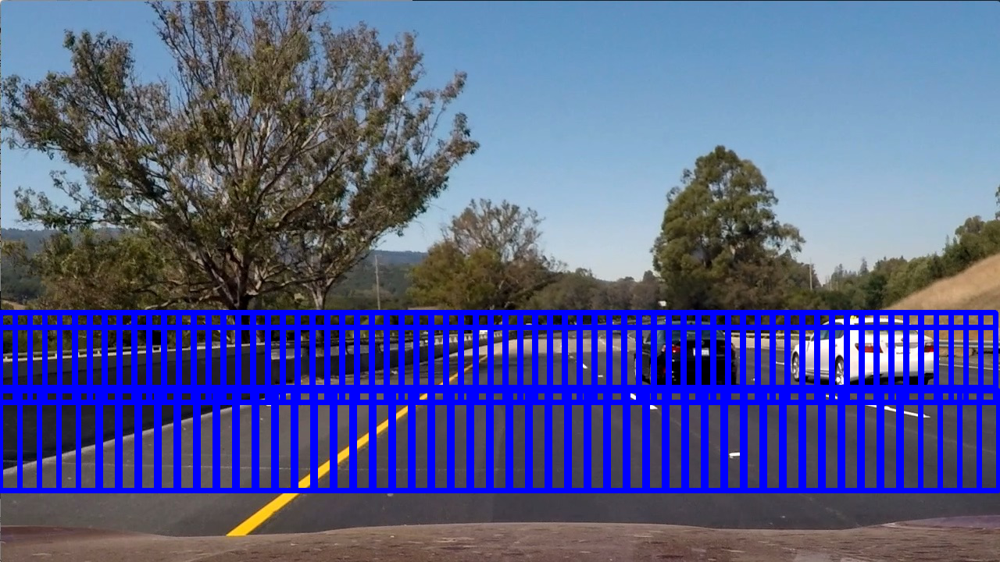
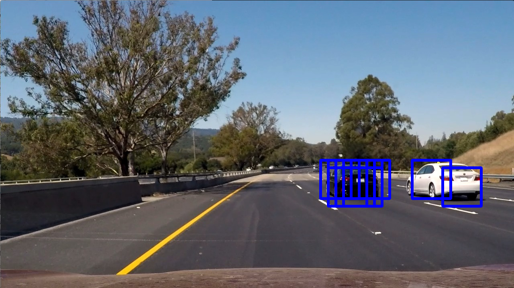
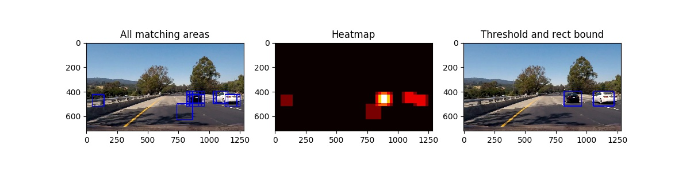
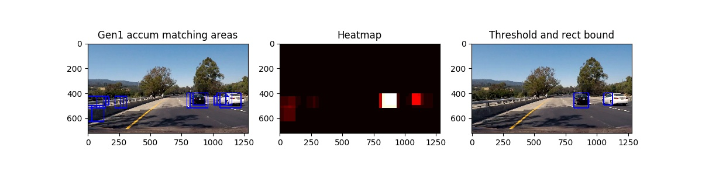

# Vehicle Detection Project

This project combines computer vision and machine learning techniques to detect nearby vehicles of a video
recorded from the driver's perspective.

This report will focus on addressing each of the project's [rubric points](https://review.udacity.com/#!/rubrics/513/view)

## Summary

A classifier will be trained to determine if a given image (or specific area of a photo) contains a vehicle or not.
This classifier is then used to scan areas of each
frame of a driving video to predict where other vehicles (if any) are to be found.

### Goals

* Using a labeled training set of vehicle/non-vehicle images, combine features from a histogram of oriented gradients (HOG),
  binned color features, and a histogram of color values to train a linear SVM classifier
* Implement a sliding-window technique and use the trained classifier to search for vehicles in an image or video frame
* Run the search on each frame of a video stream and create a heat map of recurring detections frame by frame to reject
  outliers and follow detected vehicles
* Estimate a bounding box for vehicles detected

## Training Set

Some samples of the training images are shown below.

#### Examples labeled as car present

Training images with vehicles present mostly show the rear of the vehicle.

#### Examples with no car present
Notice that many of these are not particularly appropriate for
training the project video. Specifically, many of them are trees or images often found above the horizon
line - areas that will be cropped from the classification pipeline.

## Histogram of Oriented Gradients (HOG)

HOG features are one of three types of features extracted from the images and fed into the classifier (the other two being
spatial color binning and a histogram of color channel values).

The `hog()` method from Python Scikit (`skimage.feature`) was used to determine HOG features of an image
(see `lesson_functions.py`, line 30). The following image color space and `hog()` parameters were optimized
empirically for the training images to get the highest accuracy against the validation set:

* Color space: YCrCb
* orientations: 9
* pixels_per_cell: (8, 8)
* cells_per_block: (2, 2)

#### Examples of HOG feature visualization for each channel of the color space using these optimized parameters

Car present:

No car present:

## Classifier Training

I trained a linear SVM classifier using the provided training images with 1196 vehicle images and 1125 non-vehicle images.
The following pipeline was used to extract features, and create and train a classifier (refer to `train_car_classifier.py` lines 77-115,
using the `extract_features()` function at line 20):

* Convert the image to the 'YCrCb' color model
* Bin/aggregate colors to 32x32 features for each color channel
* Calculate a histogram of color values with 32 buckets for each channel
* Determine HOG features using the optimized parameters for each channel
* Concatenate these three feature types in order into a 1-D vector (feature vector)
* Collect a feature vector for all training images
* Randomly split the feature vectors into training and validation sets
* Fit the training set with `sklearn.preprocessing.StandardScaler` for normalization of features across feature types
* Normalize the training set with the norm scaler to zero mean and unit variance
* Create and fit a `sklearn.svm.LinearSVC` classifier with the training set

Finally, the scaler and classifier objects were saved (pickled) for further classification.

#### Example of spatial color binning/aggregation (32x32):

## Sliding Window Search

To locate vehicles within an image (or video frame), I established a region of interest where vehicles are likely to be found (below the horizon).
I split the ROI into a lower and upper range, of which the lower is closer to the camera and objects will appear larger. Within
each range, I chose an appropriate window size (larger on the lower range) and imposed the window template onto overlapping areas within the range.
For each window, I extracted features using the pipeline given above and classified that window area as either containing a vehicle or not.
Window sizes, overlap amounts and region dimensions were tuned empirically using a series of test images and the project video and
visually verifying the results. The process involved striking a balance between accurate car
detection, minimizing false positives, and reasonable processing time. Processing time for a given image depended mostly on the number
of windows to be searched.

#### Example of sliding window coverage drawn on a sample image:

#### Windows predicted to contain a vehicle

The pipeline described above was applied to each window using the trained classifier to predict if a vehicle is present in that particular area:

## Video Implementation

I adapted the pipeline to process a stream of image frames from the [project video](./project_video.mp4). Refer to
the `lane_car_locate_pipeline()` function in `locate_lane_and_cars.py`, line 12 and the `locate_nearby_cars()` function
in `zone.py`, line 1244.

The feature vectors extracted must align with the vectors used during training. However, I optimized the HOG feature
extraction by applying HOG only once to the entire ROI range (for each range/sliding window size). I then ran the sliding
window process over a HOG feature representation of the image (details in the `match_vehicle_areas()`
function in `zone.py`, line 143).

The pipeline produced a noticeable number of false positives, so I employed the "heatmap" technique presented in the
course. My method involves two generations of heatmap aggregations to expose the more persistent
vehicle matching areas over a history of several frames (refer to `zone.py` lines 1250-1280).
Generation 1 is a heatmap of vehicle matching windows aggregated for a single frame.
Generation 2 is an aggregation of generation 1 heatmaps over several frames.

To create a heatmap, the `represent_heatmap()` function (`zone.py` line 123) adds a unit value to a blank image array for the area inside
every matching window. The heatmap is thresholded to reduce noise and then `scipy.ndimage.measurements.label()` was used
to identify individual blobs in the heatmap.
Any adjacent/bordering blobs from the generation 2 heatmap were merged (`merge_bordering_areas()` of `zone.py` line 1109) and
ultimately a vehicle was presumed to exist at that location.

Generation 2 heatmap vehicle positions were then matched to a history of established vehicle positions. If matched, the history
of positions of that vehicle was used to smooth the boundary coordinates (`smooth_vehicle_boundaries()` function
from `zone.py` line 1170).

Finally, an attempt was made to match any remaining established vehicle positions to generation 1 positions. So those
vehicle positions from the history buffer that were not matched to generation 2 positions were given a second chance
to survive. The reasoning here is that if an area is known to contain a vehicle, less criteria is needed to confirm
the vehicle's position in subsequent frames. Even if there is no generation 2 or 1 match, the vehicle position from
the history buffer will continue to survive according to a configurable decay rate (`propagate_vehicle_history()` function
from `zone.py` line 1217).

#### Example frame with generation 1 heatmap and thresholded results:

#### Same frame with generation 2 heatmap and thresholded results:

### Final result

The heatmap thresholds for each generation, and history buffer sizes were tuned empirically for this particular project
video (`zone.py` lines 1069-1082).

At last, I combined this vehicle detection pipeline with the advanced lane finding pipeline from the previous project
(`LaneBoundaryZone` class from `zone.py` line 274).

Result:
[output_videos/project_video_pipeline.mp4](./output_videos/project_video_pipeline.mp4)

## Discussion

For this project, I used a trained linear SVM classifier to detect other vehicles in the project video. I used a sliding
window technique, and extracted features from each window to feed into the classifier.
I used a heatmap technique to aggregate signals over several frames and to reduce noise and false positives.

My impression is that the SVM classifier is a good balance of accuracy and speed, since many windows must be analyzed for each frame
of a video, and processing time can add up quickly. That said, the classifier seemed to detect the black car better than the
white car and there were significant false positives, especially around the guard rails and bright yellow lane lines.

I don't consider the pipeline I've developed here to be particularly robust, and would have to make significant
improvements before ever considering it for practical use. I might instead start
with something like background detection/subtraction from frame-to-frame (MOG, etc) to get initial positions of
other moving objects in the vicinity. Perhaps even combining vision with sound signals to add some diversity and robustness
of features/signals.

